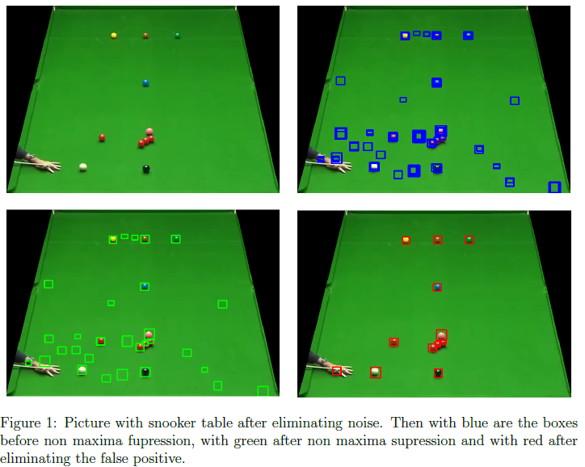

# Video analysis of a snooker footage

## Objective
The goal of this project is to develop an automatic system for video analysis of snooker footages. The system should be able to detect the snooker table and the balls on the table, track the balls, infer when a ball is potted into a pocket.

## Tasks
Your job is to write a program in Python that solves three tasks:
1. counting the number of balls on the table from an image and specifying their color;
2. analyzing a video and deciding whether a ball is potted into a pocket and if so recognizing the color of the potted ball and the pocket (one of the six pockets) where the ball was potted; 
3. tracking the cue ball and another specified ball in a video (the initial bounding boxes of the two balls to be tracked are provided for the first frame).

### Task 1 
Initially, for task number 1, the noise will be eliminated, ie any area of the image that is outside the board. To eliminate noise, template matching is used to determine the 4 pockets in the corners of the table (pockets 1, 2, 3 and 4 as numbered in the statement of task 2). Functions that do this are *get_bottom_right, get_bottom_left, get_top_left and get_top_right*. These functions are specialized for each pocket by performing the template matching algorithm for the 4 areas of the image with a series of templates. The functions listed above are called by the *get_corner*s function, which also does pocket recovery in case of occlusion (if 3 pockets are known, the fourth one can be recovered by symmetry with the middle of the board). At this point, all the corners of the table are known and all its exterior is removed by masking.
Then, after eliminating the noise, the location of the balls is determined using once again the template matching algorithm with 7 different types of balls (green from the table, only with the inside, etc.). After this step, since there are a lot of overlaps between the boxes, the non maximum suppression algorithm is run which removes from the overlapping boxes (threshold = 0.3). In the end, since there are a series of boxes that represent false positive,
these boxes are removed by calling the *false_positive* function that returns True if there is more than 50% green in the box received as a parameter. After all these steps, **88% of the balls are determined**.

A weighted voting system is used to determine the colors: each pixel in the exam patch provides a certain score for the color to which it belongs. Finally the color of the patch will be described by the most impactful 3 colors (the sum of the scores for each pixel in the examined patch) - the *get_box_color* function. The final prediction is issued by the *process_colors* function which examines all the colors of the balls and changes the colors as follows: due to a series of false positive boxes to determine more black and white balls, which
will be modified by the current function reducing everything to maximum 1. Then due to the great confusion between red, pink, yellow and brown there may be several pink balls for example. This is solved by transferring pink balls over 1 to red balls, etc. The **accuracy for color detection is 84%**.

### Task 2
To determine if a ball has been inserted in one of the 6 pockets, proceed as follows: determine the number of balls and their colors in the first frame but also in the N-10 frame (exactly as in task # 1), if the preview video has N frames. Then if the number of balls in the last frame is less than the number in the first frame then the DA hypothesis is issued (ie a ball has been inserted). Of course occlusion brings problems in this approach.

If the hypothesis is YES, then the color is calculated immediately by examining the color dictionaries in the two frames. For the detection of the pocket, proceed as follows: the proximity (plus minus 90 pixels) of the 6 pockets is analyzed throughout the video. If there is movement (the difference between frame i and frame i + 2 is more than 50 pixels that change) then I save the current frame for further analysis. This is done for all 6 pockets, resulting in 6 lists of frames in which there is movement in the area of a pocket. In the end, the pocket is considered to be the one that has the maximum color score of the ball. Of course we work with normalized data (if in the list of pocket 1 there are 5 frames and in the list of pocket 2 there are 80 frames then a score of the color of the ball that entered each of these frames is issued, it is added and is divided by their number). **The accuracy for this task is 88%.**

### Task 3
For this task we use CSRT tracker from OpenCV which for each frame in the image will issue a box containing the object of interest. Initially it receives as location what is read from the input file, then it will issue for each frame in the video a location of the ball of interest. The accuracy so far is very low, almost zero. Because if a ball goes into a pocket then the CSRT tracker will say that the ball is still in the pocket until the end of the video.

The essence of this task is the *update_boxes* function that will delete a series of boxes if a ball enters a pocket. This function receives as a parameter the video and the boxes given by the CSRT tracker. It calculates the areas of interest for the pockets (the center of the pocket plus minus 75 pixels) then calculates the frame from which the analyzed ball starts to move, analyzing the frames from 5 to 5. If the intersection over union from frame i and
at frame i-5 it is below 50% then the ball is moving. Then to calculate the stopping point in motion, do the same - if the intersection over union at frame i and frame i-5 is 90% then the ball does not move. In addition, if at this point the ball is on one of the areas of interest of the 6 pockets then it is considered that the ball has entered that pocket and the boxes at the end point of the movement are eliminated. In this way, the **accuracy for this task is 78%.**